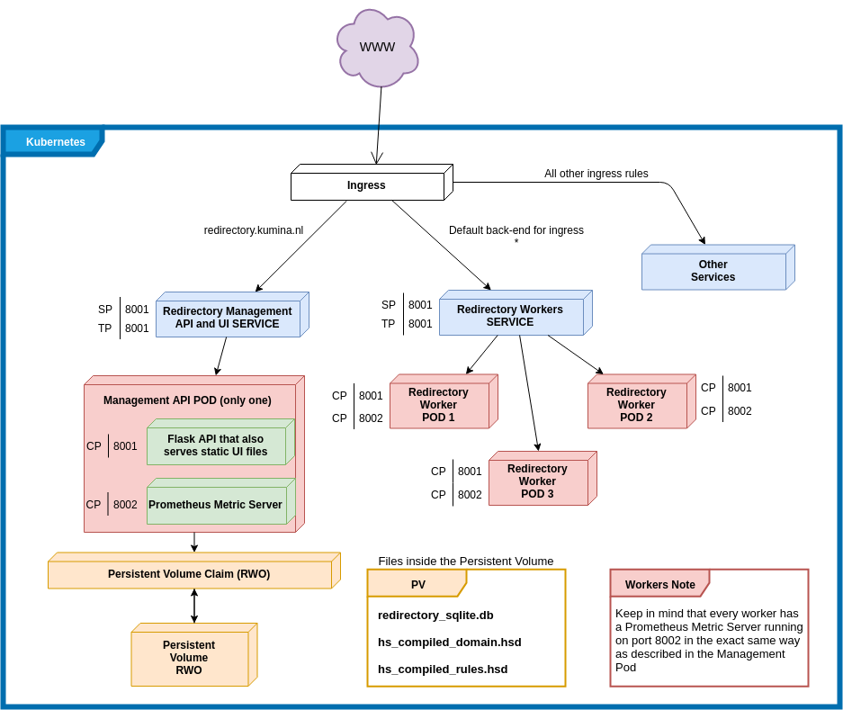

.. _redirectory-kubernetes:

************
 Kubernetes
************

Redirectory is meant to run in a Kubernetes cluster. Kubernetes
is a really huge topic and it will not be covered in this documentation.
Let's call it a pre-requisite. If you would like to get started you can
check the official `get started guide <https://kubernetes.io/docs/tutorials/kubernetes-basics/>`_.

The application is split into two parts. The worker pods which only handle
redirecting requests and a management pod which handles all other functionalities of
the application.

To gain a better understanding of how the application runs in Kubernetes please refer to
the diagram below.

