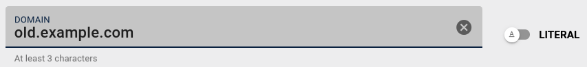
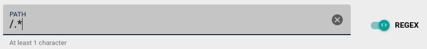
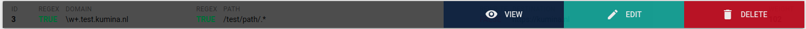
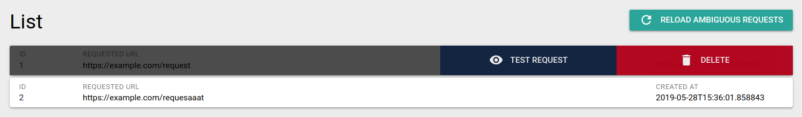
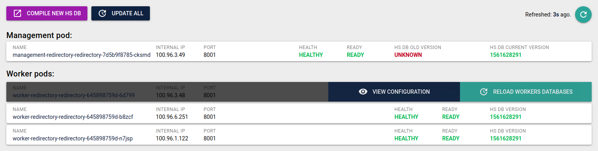

=======
 Usage
=======

This part of the documentation assumes you already have Redirectory
setup and running on a Kubernetes cluster and you have access to the
User Interface provided by the management pod.

Overview
========

This is a piece of software for redirecting requests
that would usually end up with a 404 response to a new destination specified by
given rules. It is made to work and take advantage of a Kubernetes environment.
What you are currently looking at is the so called "management panel" or whatever you
would like to call it.

From here you can manage amd access all of the features provided by Redirectory.
This User Guide aims to show you how you can use it!
Lets begin with the rules.

Rules
=====

Rules are the main things that tells Redirectory how to redirect the incoming requests.
This section will show you how to:

1. Create new rules
2. Exit existing rules
3. And delete not needed once

In order for it to redirect lets say:

.. code-block:: bash

   https://old.example.com/.* -> to -> https://new.example.com/

we will first need to enter a rule for this. First you will have
to go to the Redirect Rule Explorer section.

There underneath the search filters you will find a button **CREATE NEW REDIRECT RULE**:
Once clicked a menu with a few options will appear. The first thing to specify is
the domain you would like to redirect from. Keep in mind this domain should be configured
that it points to the cluster you are using Redirectory in. After you are done with the domain
it should look something like this:

The next thing we need to configure is the path of the domain we just added. Lets to this one the
same way as the domain. You might have noticed that we have a **(.*)** in
the path of the rule.

This is called **Regex** and it is one of the features of Redirectory, If you have
a regex expression you need to toggle to switch between **Regex** and **Literal**

See a little bit more info on Regex in the note below.

.. note::
    **REGEX** A really simple tutorial.

    Regex is quite an expansive topic we don't need much to be able to use it.
    It is used to select text and in our case URLs. Here are most of the things you will
    need to get started:

    +------------+---------------------+
    | **syntax** |     **meaning**     |
    +------------+---------------------+
    |      .     |    any character    |
    +------------+---------------------+
    |     \\d    |     just numbers    |
    +------------+---------------------+
    |     \\w    | letters and numbers |
    +------------+---------------------+
    |      \*    |     zero or more    |
    +------------+---------------------+
    |      \+    |     one or more     |
    +------------+---------------------+

    Now we can chain them together like this:

    .. code-block:: bash

      /test/path.*

    which will match any of those:

    .. code-block:: bash

      /test/path/any
      /test/path/of
      /test/path/those
      /test/path/123

Now that we now what we are actually typing in we can fill it in and it should look
like the following:

You can fill in the destination the exact same way we did the first two. The last thing
that needs to be configured is the weight of a rule. Why do we need it? Sometimes you
can get conflicting rules that both of them match the same request. When this happens Redirectory
has to know which rules has bigger weight (priority). This is expressed with the weight value
of the rule. By default all rules get a weight of 100.

Now we can just create the rule with the **CREATE** button.

Redirect Rule Explorer
======================

With the Explorer you have all the things you would need in order to manage all
of the Redirect Rules for Redirectory. Like we discussed in the Rules section here
you can create a new rule but also much more.

On top are the filters. With them you can search through all of the rules you have.
You can stack multiple filters to narrow down your search even more. Also keep in mind
that for the domain, path and destination filters you can use (*) which is an fnmatch.

.. note::
    FNMATCH or also called Function Match is a way simpler form of regex.
    Basically you can have a **(*)** which is equivalent to **(.+)** in Regex
    and and will match one or more.

After you set the filters just press the button **APPLY FILTERS**.

Once you have located the rule that you want in order to view it, edit or
delete it you can just click on it: Then the following options will be given for that rule:

Keep in mind the rules are not updated automatically in the User Interface. To make sure
your are seeing the latest changes to the rules please click the **REFRESH PAGES** button.

Bulk Import
===========

But what if I have a lot of rules? For this situation you can make use of the bulk import
feature. With it you can upload a CSV (Coma Separated Values) file and all of the rules
will be added at once. Because CSV is a basic format a lot of programs support an export to it.
You will have to refer to the documentation of the program you are using for more information on
exporting the data as CSV.

Take a look at the Bulk Import Section for more information on how the CSV file should be formated
in order to get the smooth import.

Once you have uploaded the file the import will begin immediately. The time it takes to process and add
all the rules varies on how of course how many you have.

Ambiguous requests
==================

Ambiguous requests are requests for which Redirectory was unable to decide 100% of what
should be the final destination. What does this mean? The main reason of you seeing
ambiguous requests is that you have some rules that are not configured correctly.

Sometimes it happens that two or more rules intersect each other and Regex has trouble choosing
which one is the more important one because all of them match. Example of intersection:

.. code-block:: bash

  1. ggg.test.kumina.nl/test/path/.*
  2. \\w+.test.kumina.nl/test/path/.*
  3. .*.test.kumina.nl/test/pa.*

Now if we make a requests that looks like this:

.. code-block:: bash

   ggg.test.kumina.nl/test/path/aaabb

we will match all of the three rules and Redirectory will not know which one should it choose.
When this happens Redirectory will always choose the first rule (with the smallest id) and it will
also save the request as ambiguous in order for a person to take a look and change the weights of the
rules in order not to happen again.

You will be able to see the ambiguous requests section. There are a few options you can make use of in this
section.
On the top right there is the **RELOAD AMBIGUOUS REQUESTS** button:
Once you click an entry/request you are presented with two options.
Test option will put this request in the Test Section and show you what is happening
behind the scenes. From there you can specify the correct weights for the rules in order
to avoid any ambiguous requests in the future.
Once you have fixed the issue for a given ambiguous request you can delete it with the
second option. See image below for better understanding.

Hyperscan Database
==================

You have probably noticed that when adding, updating and deleting a rule
you have a message that say that the changes will not apply until you
compile a new Hyperscan database. This is due to the backend and how Hyperscan works.
First make all the changes you would like and then once you are done with all of them
you can compile/create a new Hyperscan database.

The settings are located in the Hyperscan Database and Workers Section.
Now that you have made the changes you wanted to the rules you can press the
**COMPILE NEW HS DB** button. This will create a new Hyperscan Database and
apply it to all of the workers. That is everything you need to be worried about
with Hyperscan. If you are interested in the workers and how they work please take
a look at the next section in the User Guide.

Workers and Kubernetes
======================

Redirectory is an application that runs in Kubernetes and makes use of it's scaling features.
That is why the application is split into two parts: **management** and **workers**.

The workers are the one that process all of the incoming requests. That is why they need to
be up to date with the newest version of the Hyperscan Database. In other words the Redirect Rules.

You will find all of the options for the management and workers in the Hyperscan Database and Workers
Section.
From there you can see the status of each worker and the current database they have loaded on them. This
information
updates automatically every 10 seconds or you can click the **REFRESH** button to update now.

The **COMPILE NEW HS DB** button creates a new database and **updates all the workers** after that.
If for some reason a worker is out of date you can use the **UPDATE ALL** button or by clicking
on the out of date workers and updating it individually. From there you can view the configuration
of the workers as well. Take a look at the picture below:

