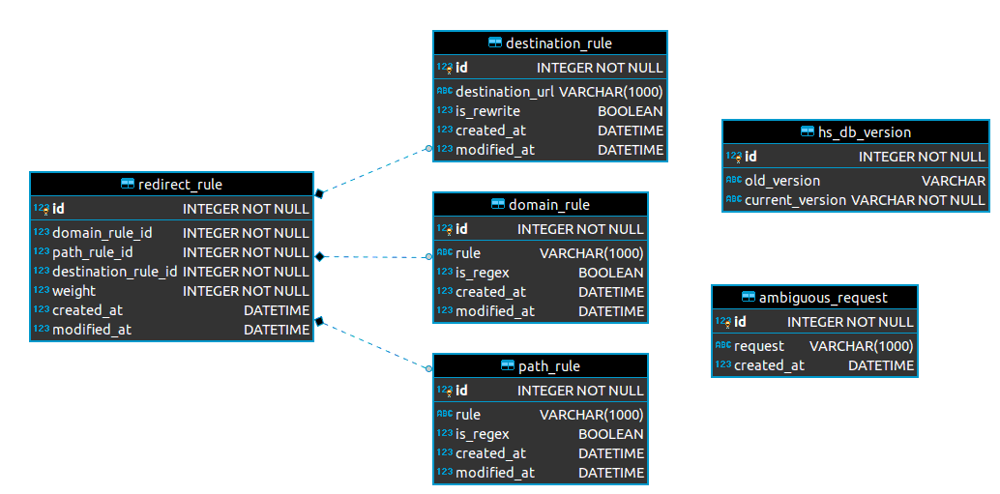

Models package
==========================

Here as a diagram of the database followed by their corresponding classes. I think
they are simple enough to understand directly ;)

Redirect Rule
^^^^^^^^^^^^^

.. literalinclude:: ../../redirectory/models/redirect_rule.py
  :language: Python
  :linenos:

Path Rule
^^^^^^^^^

.. literalinclude:: ../../redirectory/models/path_rule.py
  :language: Python
  :linenos:

Domain Rule
^^^^^^^^^^^

.. literalinclude:: ../../redirectory/models/domain_rule.py
  :language: Python
  :linenos:

Destination Rule
^^^^^^^^^^^^^^^^

.. literalinclude:: ../../redirectory/models/destination_rule.py
  :language: Python
  :linenos:

Ambiguous Requests
^^^^^^^^^^^^^^^^^^

.. literalinclude:: ../../redirectory/models/ambiguous_requests.py
  :language: Python
  :linenos:

Hyperscan DB Version
^^^^^^^^^^^^^^^^^^^^

.. literalinclude:: ../../redirectory/models/hyperscan_db_version.py
  :language: Python
  :linenos:
